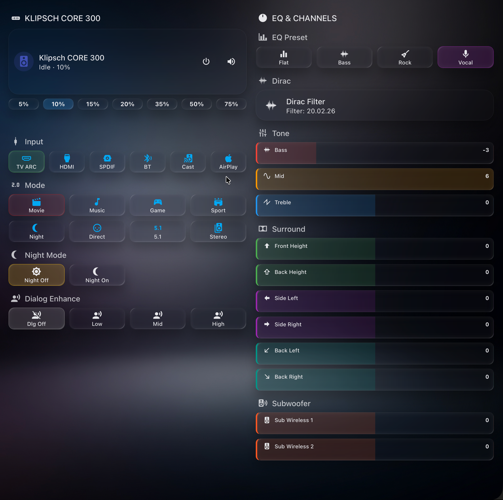
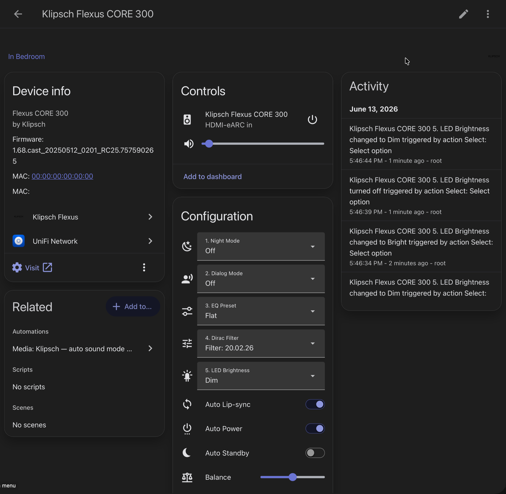

# Klipsch Flexus

🌐 [English](../README.md) | **Русский** | [Deutsch](README_de.md) | [Español](README_es.md) | [Português](README_pt.md)

---

Кастомная интеграция Home Assistant для саундбаров **Klipsch Flexus** — управление через **локальный HTTP API**, без облака, без задержек.

> ✅ **Актуально на v2.5.12 (2026-06-13)** — **41 сущность**, все команды записи проверены вживую на прошивке 2026 (HMAC-подпись), управляемы в standby. Бейджи выше отражают актуальный релиз и последний push.

## 📸 Панель (Dashboard)

Кастомная Lovelace-панель целиком на сущностях интеграции — вход, звуковой режим, ночной/диалог, EQ-пресеты, фильтр Dirac, тон (bass/mid/treble), уровни surround-каналов и сабвуферы — всё вживую по локальному API.

**Нужные компоненты HACS** (всё ставится через [HACS](https://github.com/hacs/integration)):

| Компонент | Репозиторий | Зачем |
|-----------|-------------|-------|
| Klipsch Flexus | [ilia-ae/klipsch_flexus](https://github.com/ilia-ae/klipsch_flexus) | сама интеграция — сущности |
| Mushroom | [piitaya/lovelace-mushroom](https://github.com/piitaya/lovelace-mushroom) | карта медиаплеера |
| button-card | [custom-cards/button-card](https://github.com/custom-cards/button-card) | тайлы вход/режим/EQ с динамической стилизацией |
| card-mod | [thomasloven/lovelace-card-mod](https://github.com/thomasloven/lovelace-card-mod) | подсветка активного состояния (CSS) |

📋 **Полный YAML панели + цветовая схема:** [docs/DASHBOARD.md](DASHBOARD.md)

### Поддерживаемые модели

| Модель | Каналы | Особенности |
|--------|--------|-------------|
| **Flexus CORE 300** | 5.1.2 | Dirac Live, Dolby Atmos, 13 драйверов |
| **Flexus CORE 200** | 3.1.2 | Dolby Atmos up-firing |
| **Flexus CORE 100** | 2.1 | Virtual Dolby Atmos |

> Саундбар нужно **сначала полностью настроить в официальном приложении Klipsch Connect Plus** — пройдите весь онбординг хотя бы один раз (Wi-Fi, обновление прошивки, подключение колонок, калибровка Dirac). На прошивке 2026 года именно это создаёт учётные данные для подписи команд, поэтому при незавершённой настройке большинство команд останутся без авторизации. Интеграция отвечает только за текущее управление.

## ⚠️ Совместимость с прошивкой (обновление 2026)

Обновление прошивки 2026 года (**Device Version `1.1.3.x`**, например `1.1.3.0x7cd294e`, Cast-сборка `20250512_0201_RC25`) изменило локальный HTTP API двумя способами:

1. **`setData` теперь требует `POST` с JSON-телом.** Старый `GET /api/setData?...` возвращает `405 Strict HTTP required!`. **Исправлено в v2.4.1** — обновите интеграцию.
2. **Большинство записей `setData` теперь требуют авторизации** (`settings:/webserver/authMode = setData`). Защищённые команды отвечают `401 Forbidden` с заголовком `WWW-Authenticate: HMAC_SHA256_AES256`. **Исправлено в v2.5.0** — интеграция теперь подписывает такие записи автоматически.

### Что работает на новой прошивке

| Возможность | Статус |
|-------------|--------|
| Все сенсоры / чтение статуса (`getData`) | ✅ Работает |
| Громкость, без звука (Mute) | ✅ Работает |
| Вход, звуковой режим, ночной/диалог, бас/средние/высокие, пресет EQ, Dirac, сабвуфер и surround-уровни, питание | ✅ Работает (подпись HMAC, v2.5.0+) |
| LED, lip-sync, баланс, Loudness, DND, авто-standby + ещё 4 переключателя | ✅ Работает (с подписью; добавлено в v2.5.8–2.5.9) — в том числе в standby |

Текущий статус по каждой команде виден в **Download diagnostics** (раздел `command_health`, добавлен в v2.4.2).

### Статус исправления

✅ **Решено в v2.5.0 — полное управление восстановлено, действий от пользователя не требуется.** Подпись запросов `HMAC_SHA256_AES256` реализована. Учётные данные устройства выводятся автоматически из MAC-адреса саундбара (который интеграция и так определяет), поэтому **настраивать ничего не нужно** — просто обновите интеграцию. Начиная с **v2.5.9** MAC считывается детерминированно с самого устройства (`settings:/system/primaryMacAddress`), поэтому определение срабатывает с первого раза на любом экземпляре (прежний поиск через реестр/ARP оставлен как запасной вариант). Подписанные записи уходят на HTTPS-эндпоинт устройства; громкость/Mute продолжают работать без подписи.

> Требуется пакет `cryptography` (указан в манифесте; поставляется вместе с Home Assistant, поэтому уже присутствует).

📖 **Как мы это вскрывали** — вся история расследования (blutter, Frida, WireGuard-MITM, разбор «security-театра»): [рапорт](REPORT.md) (есть и [на английском](REPORT_en.md)).

Старые прошивки (до `1.1.3`) не затронуты и сохраняют полное управление через устаревший `GET`-fallback.

## Возможности

### Медиаплеер
- **Громкость** — уровень, шаг вверх/вниз, выключение звука
- **Питание** — включение / режим ожидания
- **Источник сигнала** — TV ARC, HDMI, SPDIF, Bluetooth, Google Cast
- **Режим звука** — Movie, Music, Game, Sport, Night, Direct, Surround, Stereo
- **Воспроизведение** — play/pause, следующий/предыдущий трек
- **Медиа-данные** — название, артист, альбом, обложка, приложение-источник

### Уровни каналов (11 слайдеров, от -6 до +6 дБ)

| Канал | Описание |
|-------|----------|
| Front Height | Верхний фронтальный (Dolby Atmos) |
| Back Height | Верхний тыловой (Dolby Atmos) |
| Side Left / Right | Боковые окружающие колонки |
| Back Left / Right | Тыловые окружающие колонки |
| Subwoofer Wireless 1 / 2 | Беспроводные сабвуферы |
| Bass / Mid / Treble | Тембр: НЧ / СЧ / ВЧ |

### Настройки звука (Select)
- **EQ Preset** — Flat, Bass, Rock, Vocal
- **Ночной режим** — снижает динамический диапазон для тихого прослушивания
- **Режим диалога** — усиливает речь (3 уровня)
- **Dirac Live** — коррекция помещения (фильтры считываются с устройства)
- **Яркость LED** — передний светодиод: Off / Dim / Bright

### Настройки (Number)
- **Задержка lip-sync** — ручная синхронизация A/V (0–300 мс)
- **Баланс** — лево/право (−10…+10)
- **Таймаут простоя** — время до авто-перехода в standby (0–3600 с)

### Переключатели (Switch)
- **Авто lip-sync** — автоматическая задержка A/V
- **Обход EQ** — отключение эквалайзера
- **Авто-питание** — автоматическое поведение вкл/standby
- **Loudness** — компенсация громкости на низком уровне
- **Не беспокоить** — подавление уведомлений/звуков
- **Авто-standby** — переход в режим ожидания при простое
- **Звуки интерфейса**, **Доп. звуковые режимы**, **Авто-сопряжение BLE-пульта**, **Авто-обновление прошивки**

> Все перечисленные выше настройки можно записывать и когда саундбар в **режиме ожидания** (устройство применяет и сохраняет их); интеграция держит сущности доступными и запоминает заданное значение, а не откатывает его.

### Диагностика
- **Время отклика** — длительность опроса API в мс, счётчики запросов/ошибок
- **Статус устройства** — Вкл / Ожидание / Оффлайн с информацией о декодере, входе, режиме
- **MAC для подписи** — MAC, которым подписываются записи на прошивке 2026 (схема, кандидаты, разрешённое состояние)
- **Сетевое подключение** — активный проводной/беспроводной интерфейс, имена интерфейсов, источники MAC
- **Режим работы** / **Тест колонок** — состояние устройства только для чтения (отображается, намеренно без управления)
- **Задержки колонок** (проводной/беспроводной саб, беспроводной surround) — только для чтения, авто-калибровка устройством
- **Скачать диагностику** — полный дамп состояния (Настройки > Устройства > Klipsch Flexus > Скачать диагностику)

### Переводы
Полный перевод интерфейса на **7 языков**: английский, русский, немецкий, испанский, французский, итальянский, португальский. Все имена сущностей, состояния и экраны настройки переведены.

## Установка

### HACS (рекомендуется)

1. Откройте **HACS** > Интеграции > найдите **Klipsch Flexus**
2. Установите и перезапустите Home Assistant
3. Саундбар должен **обнаружиться автоматически** — проверьте уведомления
4. Или перейдите в **Настройки** > Устройства и службы > **Добавить интеграцию** > Klipsch Flexus

### Вручную

1. Скопируйте `custom_components/klipsch_flexus/` в директорию `config/custom_components/` вашего HA
2. Перезапустите Home Assistant
3. Добавьте интеграцию через Настройки > Устройства и службы

## Автообнаружение

Саундбар автоматически обнаруживается в сети через **mDNS / Zeroconf** (протокол Google Cast).

При включённом саундбаре Home Assistant покажет уведомление:
> Найден **Klipsch Flexus CORE 300** по адресу `192.168.1.100`. Добавить этот саундбар?

**Как это работает:**
- Саундбар анонсирует себя как `Flexus-Core-*` через сервис `_googlecast._tcp` mDNS
- Интеграция определяет устройство по TXT-записям `md` (модель) и `fn` (имя)
- Прокси AirCast автоматически отфильтровываются

Если автообнаружение не работает (например, сетевая изоляция), вы всегда можете добавить интеграцию вручную, указав IP-адрес.

## Конфигурация

| Параметр | По умолчанию | Описание |
|----------|-------------|----------|
| Host | — | IP-адрес саундбара (обязательно) |
| Интервал опроса | 15 с (60 с в standby) | Настраивается в опциях (5–120 с); автоматически снижается в режиме ожидания |

**Совет:** Назначьте статический IP / DHCP-резервацию для стабильной работы.

Изменить IP можно позже через **Перенастройка** (Настройки > Устройства > Klipsch Flexus > Перенастройка).

## Как это работает

Саундбар предоставляет локальный HTTP API на порту 80:
- `GET /api/getData` — чтение параметров
- `POST /api/setData` — запись параметров (JSON body; для старых прошивок — fallback на GET)
- `GET /api/getRows` — списки данных (фильтры Dirac)

### Устойчивая работа с медленным устройством

Klipsch Flexus имеет **однопоточный HTTP-сервер**, обрабатывающий один запрос за раз. Интеграция учитывает это ограничение:

| Механизм | Описание |
|----------|----------|
| Сериализация запросов | Все вызовы API проходят через `asyncio.Lock` — без параллелизма |
| Повторы с задержкой | Временные ошибки повторяются 2 раза с задержкой 0.5 с |
| Адаптивные таймауты | 8 с чтение, 10 с запись, 15 с команды питания |
| Грациозная деградация | При ошибке чтения используется последнее кешированное значение |
| Оптимистичные обновления | UI обновляется мгновенно, затем подтверждается отложенным опросом; значения, заданные в standby, кешируются, поэтому опрос в режиме ожидания их не откатывает |
| **Опрос с учётом standby** | Сначала проверяется состояние питания; в режиме ожидания — 1 запрос вместо 20+, кешированные значения сохраняются, интервал опроса снижается до 60 с. Настройки остаются **доступными и управляемыми** в standby — устройство применяет записи, а интеграция их запоминает |

## Сущности

*Страница устройства в Home Assistant — Device info, Controls, Configuration (Night / Dialog / EQ / Dirac / LED + переключатели) и журнал активности.*

| Сущность | Тип | Категория |
|----------|-----|-----------|
| Klipsch Flexus CORE 300 | Медиаплеер | — |
| Ночной режим / Режим диалога / Эквалайзер / Фильтр Dirac / Яркость LED | Select (x5) | Конфигурация |
| Back Height / Left / Right, Front Height, Side Left / Right | Number (x6) | Конфигурация |
| Subwoofer Wireless 1 / 2 | Number (x2) | Конфигурация |
| Bass / Mid / Treble | Number (x3) | Конфигурация |
| Задержка lip-sync, Баланс, Таймаут простоя | Number (x3) | Конфигурация |
| Авто lip-sync, Обход EQ, Авто-питание, Звуки интерфейса, Доп. звуковые режимы, Авто-сопряжение BLE-пульта, Авто-обновление прошивки | Switch (x7) | Конфигурация |
| Loudness, Не беспокоить, Авто-standby | Switch (x3) | Конфигурация |
| Время отклика, Статус устройства, Активный вход, Режим звука | Sensor (x4) | Диагностика |
| MAC для подписи, Сетевое подключение | Sensor (x2) | Диагностика |
| Режим работы, Тест колонок, Задержка проводного/беспроводного саба, Задержка surround | Sensor (x5, только чтение) | Диагностика |

**Всего: 41 сущность** (1 медиаплеер + 5 select + 14 number + 10 switch + 11 sensor)

## Решение проблем

| Проблема | Решение |
|----------|---------|
| Не подключается | Проверьте, что саундбар в той же сети. Попробуйте: `http://<IP>/api/getData?path=player:volume&roles=value` |
| Сущности недоступны | Приложение Klipsch может опрашивать одновременно — закройте его |
| Медленные обновления | Увеличьте интервал опроса в Настройках интеграции |
| Интеграция не загружается | Проверьте логи HA на ошибки импорта. Нужен HA 2024.11+ |

## Известные ограничения

- Один саундбар на запись интеграции (для нескольких — добавляйте отдельно)
- Нет управления мультирумом / группами беспроводных колонок (используйте Klipsch Connect Plus)
- AirPlay и Cast не используются — только нативный HTTP API
- Первоначальную настройку нужно **полностью** пройти в официальном приложении Klipsch Connect Plus — весь онбординг хотя бы один раз (именно это создаёт учётные данные для записи на прошивке 2026 года)

## Лицензия

MIT — см. [LICENSE](../LICENSE).
